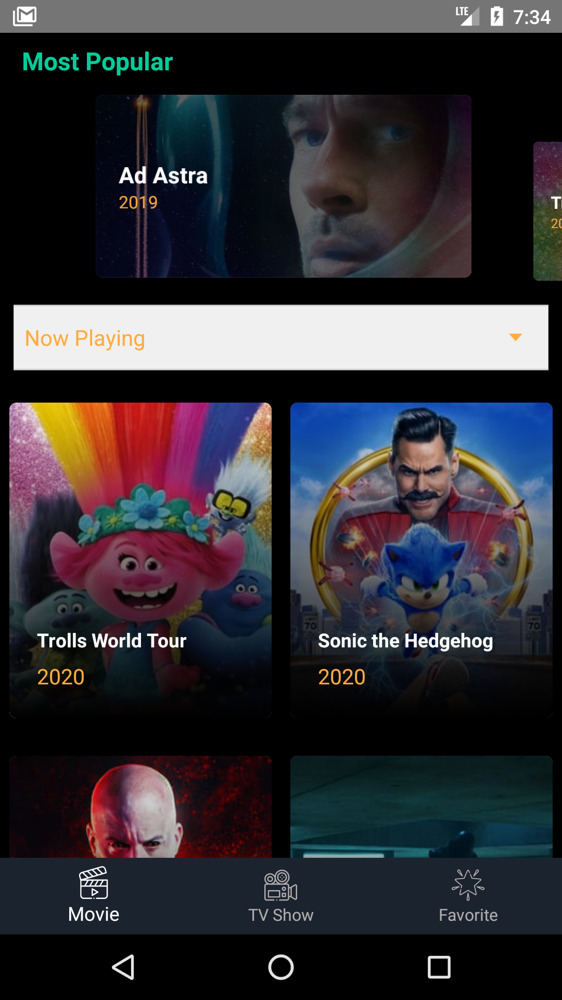

# Android Kotlin MVVM MovieMe
Movie catalogue apps with API from The movie db https://developers.themoviedb.org/

### Tech Stack
1. Kotlin
2. MVVM 
3. Live Data
4. [Koin](https://start.insert-koin.io/#/) as Dependency Injection Lib
5. [Retrofit](https://square.github.io/retrofit/) as Networking Lib
6. [Groupie](https://github.com/lisawray/groupie) as RecyclerView Lib
7. sdp ssp
8. Glide Image Loader
9. Room database
10. Kotlin Coroutines
11. [Spek2 Framework](https://www.spekframework.org/) for unit testing 
12. [Android Spinkit](https://github.com/ybq/Android-SpinKit) for loading animation
13. [Timber](https://github.com/JakeWharton/timber) as Logger Lib

### Reference
1. [Dicoding - Belajar Android Jetpack Pro](https://www.dicoding.com/academies/129)
2. [Tutorial android : Retrofit dan Coroutines](https://pratamawijaya.com/android/android-retrofit-coroutines/)

### License: ###
~~~~
Copyright 2020 Dwi Teguh Prasetyo 

Licensed under the Apache License, Version 2.0 (the "License");
you may not use this file except in compliance with the License.
You may obtain a copy of the License at

   http://www.apache.org/licenses/LICENSE-2.0

Unless required by applicable law or agreed to in writing, software
distributed under the License is distributed on an "AS IS" BASIS,
WITHOUT WARRANTIES OR CONDITIONS OF ANY KIND, either express or implied.
See the License for the specific language governing permissions and
limitations under the License.
~~~~
